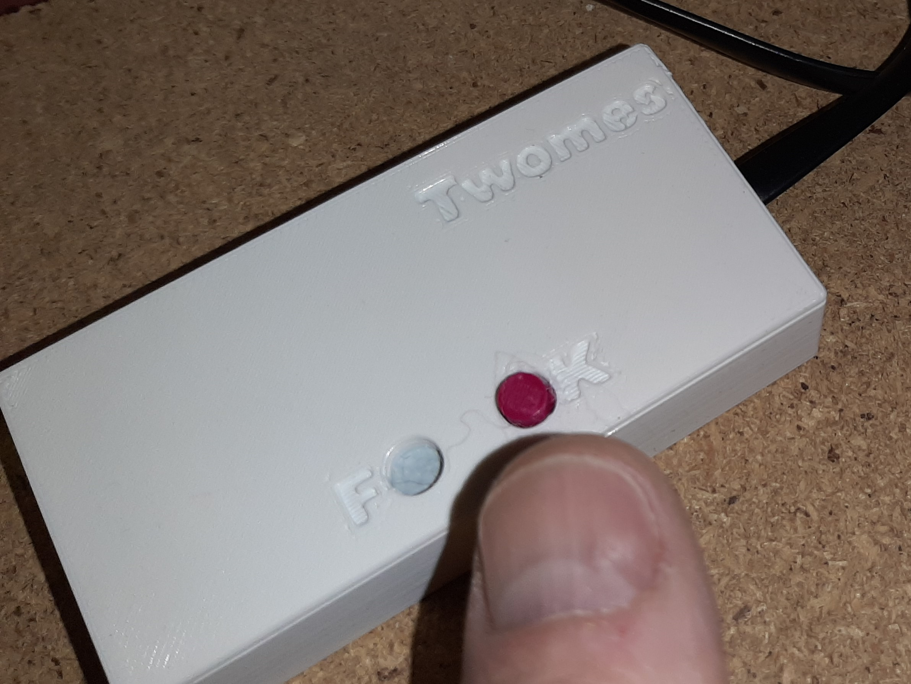

# Slimmemetermodule - FAQ

Veelgevraagde informatie over de slimmemetermodule.

# 1. Welke gegevens verzamelt dit apparaat?

Elke 10 minuten meet de slimmemetermodule via de P1-poort van uw slimme elektriciteitsmeter:

- tellerstanden van uw gasmeter;
- tellerstanden van uw elektriciteitsmeter;
- DSMR versie en type van uw elektriciteitsmeter.

## 2. Hoe kan ik het apparaatje installeren?

Zie hiervoor de [installatiehandleiding](../../../installation/).

## 3. Hoe weet ik of het apparaatje goed werkt? 

Elke keer dat de slimme meter succesvol wordt uitgelezen, ziet u een lichtje twee keer snel groene knipperen. Als het uitlezen niet lukt, ziet u een lichtje twee keer snel rood knipperen. De slimme meter wordt op vaste tijden uitgelezen: elk heel uur en 10, 20, 30, 40 en 50 minuten na het hele uur. U kunt erop wachten als u het zeker wilt weten. De 'Laatst gezien op' tijd onder 'Sluimmemetermodule' in het 'Bronnen' scherm van de NeedForHeat app wordt vrij snel daarna ook bijgewerkt (gebruik pull-down om te vernieuwen).

## 4. Hoe kan ik het apparaatje opnieuw koppelen aan wifi?

Een wifi-reset van het apparaatje kan nodig zijn als je wifinetwerk thuis verandert, als je het apparaatje aan een ander wifinetwerk thuis wilt koppelen of om andere redenen. 

De wifi-reset werkt als volgt:

1. Hou de K-knop van de slimmemetermodule ingedrukt (je voelt een duidelijke klik).
2. Laat de knop los na ruim 10 seconden, nadat je een groen lampje 5 keer hebt zien knipperen (als het te licht is ziet u het wellicht niet).
3. In de NeedForhat app, scan de QR-code van uw slimmemetermodule opnieuw en volg de aanwijzingen.

## 5. Waar kan ik meer technische info vinden over dit apparaatje?
De broncode van dit meetapparaatje is openbaar beschikbaar via GitHub via [needforheat-p1-reader-firmware](https://github.com/energietransitie/needforheat-p1-reader-firmware).

## Wat als ik andere vragen of opmerkingen heb?
Stuur dan een e-mail naar de helpdesk van het NeedForHeat-onderzoek via [needforheatonderzoek@windesheim.nl](needforheatonderzoek@windesheim.nl).
