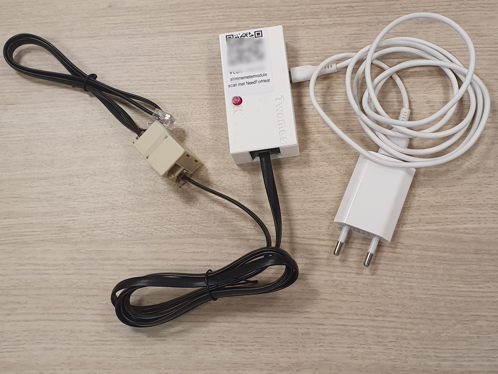
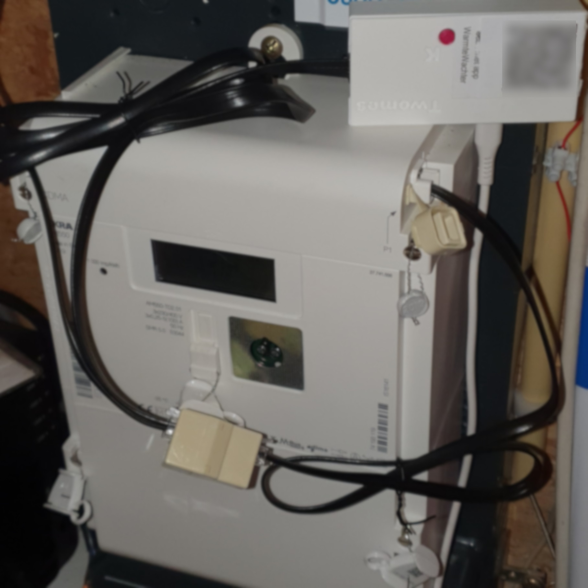

# Smart meter module

# About the device

Every 10 minutes, the smart meter module registers information about the readings of your gas and electricity meters via the P1 port of your smart electricity meter.
        
# Installation

The smart meter module consists of a p1-gateway and cable (top), a splitter with another cable (bottom left) and a USB power adapter (bottom right).

Follow all steps below before you continue in the NeedForHeat app. If you have any questions after reading these instructions, please first check the [smart meter module device FAQ](../../faq/) section. There you will also find information on how to get assistance if you are unable to proceed.

## 1. Check if cables are properly connected to each other

In the box you have received, the cables of the smart meter module are connected to each other; it should look like the picture above indicates. You may remove any cable ties so that the cables are no longer coiled.

## 2. Connect the connector of the smart meter module to the p1 port

Locate the P1 port on your smart electricity meter.

_The P1 port is located on the front or bottom of many smart meters. Sometimes there is an easily removable cover in front of it._

If there is already a cable plugged into the P1 port, unplug it and plug it in the free connector of the splitter.

Insert the free connector of the short black cable into the P1 port of your smart electricity meter.

You should feel a distinct click, indicating that the plug is properly connected.  

Find a stable place for your smart meter module.

## 3. Plug in the power cord.

Plug the power adapter into an available electrical outlet near your smart meter.

This is what a connected smart meter module may look like:

## 4. Connect the device with your home Wi-Fi.

Continue in the NeedForHeat app to connect the device to your home Wi-Fi network.