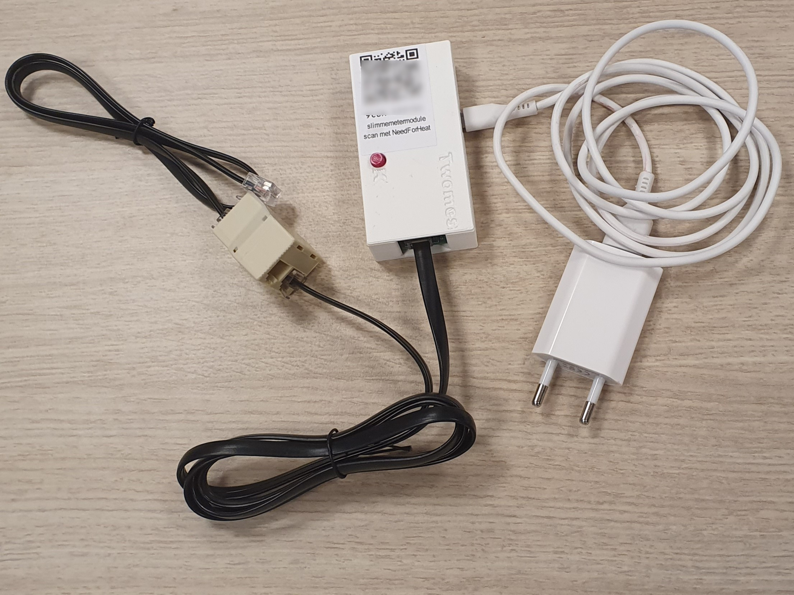

# Slimmemetermodule

# Over het apparaat

Elke 10 minuten registreert de slimmemetermodule informatie over de tellerstanden van uw gas- en elektriciteitsmeter via de P1-poort van uw slimme elektriciteitsmeter en stuurt deze, samen met informtie over versie en type van uw slimme meter door naar de onderzoeksserver.

# Installatie

De slimmemetermodule bestaat uit een p1-gateway en kabel (boven), een splitter met nog een kabel (links onder) en een USB-voedingsadapter (rechts onder).

Volg alle onderstaande stappen voordat u verder gaat in de NeedForHeat-app. Als u na het lezen van deze instructies nog vragen heeft, controleer dan eerst de [FAQ-sectie voor de slimmemetermodule apparaat](../../../faq/). Daar vindt u ook informatie over hoe u hulp kunt krijgen als u niet verder kunt.

## 1. Check of kabels goed op elkaar zijn aangesloten 

In de doos die u heeft ontvangen, zijn de kabels van de slimmemetermodule op elkaar aangesloten; het moet eruit zien zoals op bovenstaande foto is aangegeven. Eventuele kabelbinders mag u verwijderen, zodat de kabels niet meer zijn opgerold.

## 2. Sluit connector aan op de p1-poort

Zoek de P1-poort op uw slimme elektriciteitsmeter.

_De P1-poort bevindt zich aan de voorkant of onderkant van veel slimme meters, soms achter een klepje._

Als er al een kabel in de P1-poort is aangesloten, haal deze er dan uit en sluit deze aan op de vrije connector van de splitter.

Steek de vrije connector van de korte zwarte kabel in de P1-poort van uw slimme elektriciteitsmeter.

U zou een duidelijke klik moeten voelen, wat aangeeft dat de stekker correct is aangesloten.

Zoek een stabiele plek voor uw slimmemetermodule.

## 3. Steek de stekker in het stopcontact.

Steek de voedingsadapter in een beschikbaar stopcontact in de buurt van uw slimme meter.

Hieronder volgt een voorbeeld van een aangesloten slimmemetermodule:

## 4. Verbind het apparaat met uw wifi thuis.

Ga verder in de NeedForHeat-app om het apparaat te verbinden met uw wifinetwerk thuis.
